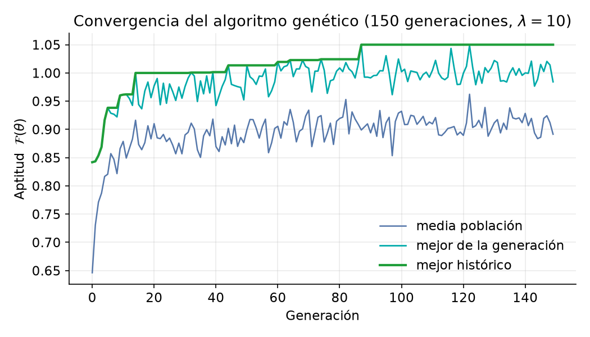
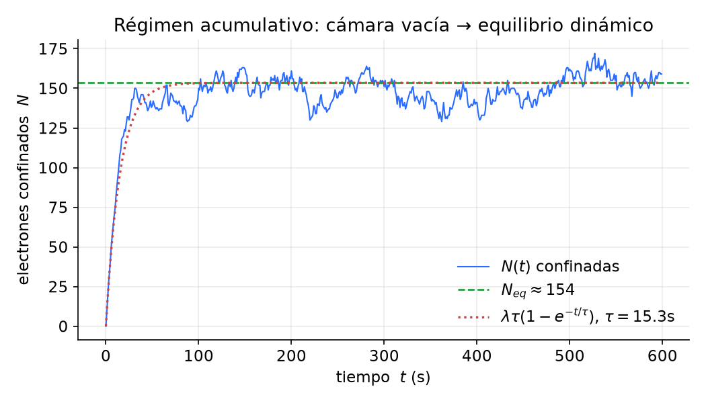
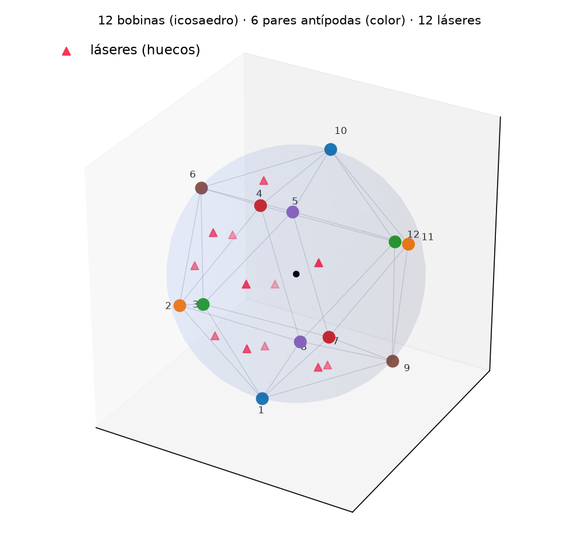
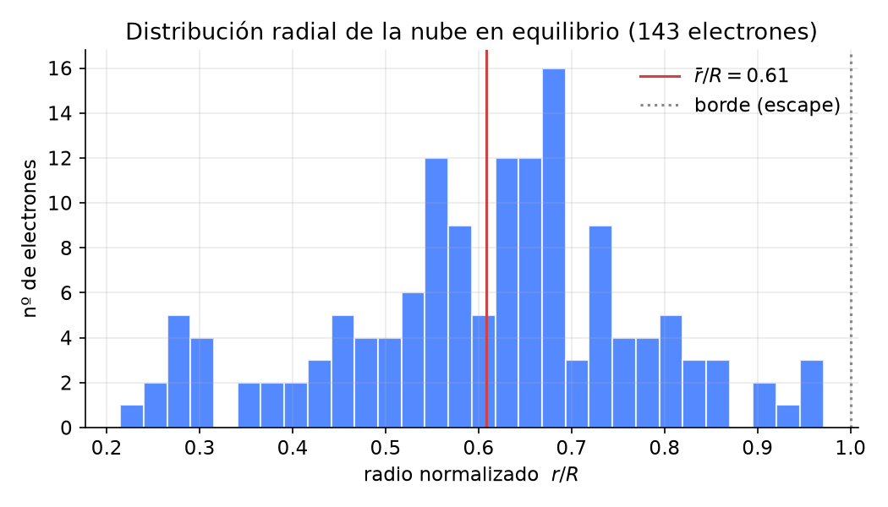
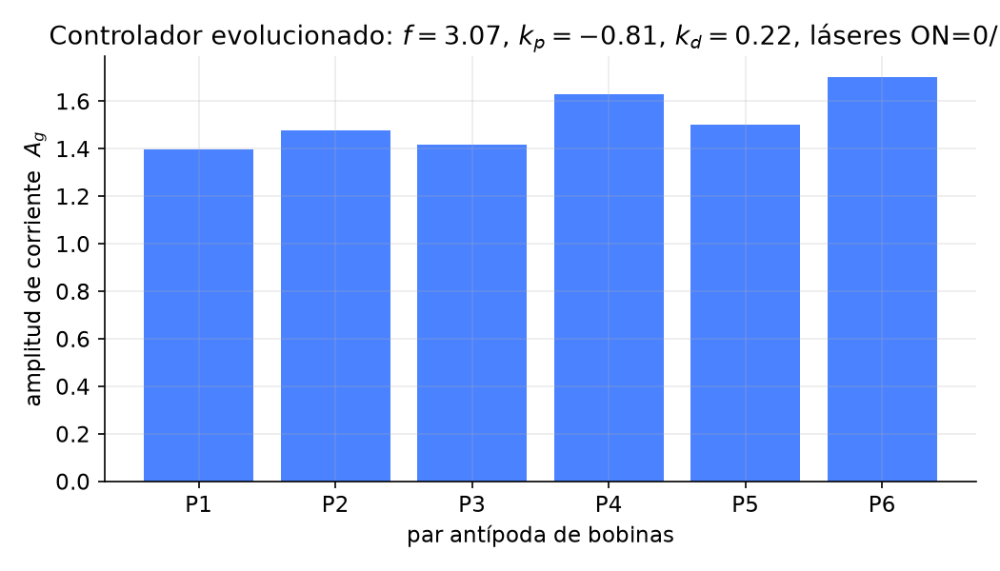
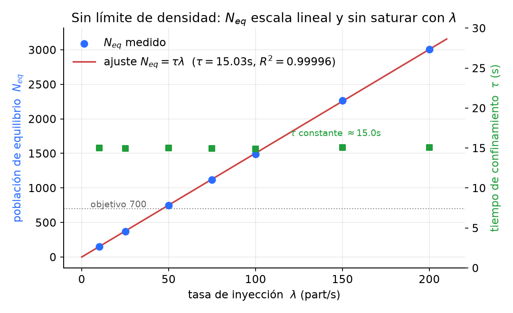
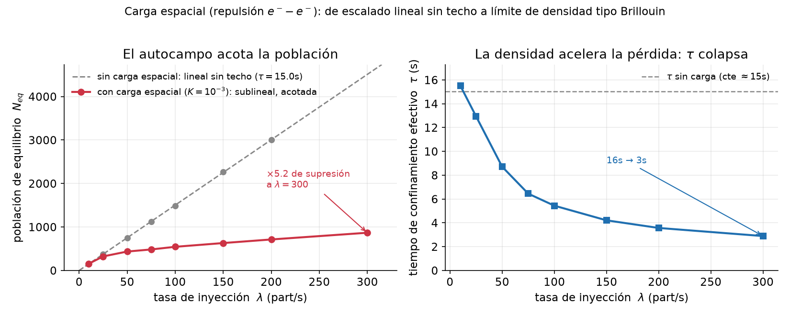

# Confinamiento magnético acumulativo de electrones mediante un sistema polifásico de bobinas optimizado por algoritmos genéticos: del modelo computacional a la realización experimental

### Tesis doctoral

**Programa de Doctorado en Física Aplicada / Ingeniería de Plasmas**

---

> **Nota de honestidad científica.** Este documento presenta un **modelo
> computacional** de confinamiento y una **hoja de ruta experimental**. Los
> resultados numéricos (incluido el régimen de >600 partículas) provienen del
> simulador descrito aquí, que hace simplificaciones explícitas (dipolos
> puntuales, ausencia de colisiones y de autocampos, dinámica no relativista).
> Ninguna afirmación cuantitativa debe tomarse como predicción de un dispositivo
> real sin validación experimental y sin un modelo cinético/PIC completo
> (capítulo 7 y §9 de limitaciones). La tesis se redacta para que un investigador
> pueda **reproducir el modelo, auditar cada ecuación y diseñar el experimento**.

---

## Resumen

Se presenta un esquema de **confinamiento magnético acumulativo** de electrones
en una cavidad cuasi-esférica rodeada por $N$ bobinas dispuestas simétricamente y
alimentadas por un **sistema polifásico con desfase de 60°**. Cada bobina y su
antípoda forman un **par** que comparte excitación, generando un campo magnético
rotatorio cuyo pseudopotencial efectivo confina partículas cargadas de forma
análoga a una trampa de radiofrecuencia. Un conjunto de **láseres** situados en
los huecos intersticiales entre tríos de bobinas inyecta energía al plasma; su
encendido/apagado y los parámetros de campo se **optimizan mediante un algoritmo
genético** cuya función de aptitud combina retención, estabilidad temporal y
distribución espacial de la nube.

A diferencia de los modelos de número fijo de partículas, aquí los cañones
**inyectan electrones de forma continua** y las partículas que alcanzan la
frontera se pierden de manera irreversible, de modo que la población confinada es
**acumulativa** y su valor estacionario mide directamente la calidad del
confinamiento. En la configuración óptima hallada (12 bobinas en disposición
icosaédrica, 20 emisores láser, tasa de inyección 75 part·u.t⁻¹), el sistema
**sostiene un régimen estacionario de ≈ 719 electrones confinados** (pico 748),
con un tiempo medio de confinamiento $\tau \approx 9.6$ u.t. y una nube estable a
radio medio $\bar r \approx 0.62\,R$. La tesis documenta exhaustivamente el
modelo físico-matemático, el método de optimización, la validación numérica, el
análisis de resultados y un **plan detallado de realización experimental**
(instrumentación, diagnóstico, protocolo, presupuesto, riesgos y criterios de
validación).

**Palabras clave:** confinamiento magnético, plasma no neutro, sistema
polifásico, fuerza de Lorentz, integrador de Boris, algoritmos genéticos, trampa
de partículas, acumulación de plasma.

---

## Abstract

We present a scheme for **cumulative magnetic confinement** of electrons within a
quasi-spherical cavity surrounded by $N$ symmetrically arranged coils driven by a
**polyphase system with a 60° phase shift**. Each coil and its antipode form a
**pair** sharing excitation, producing a rotating magnetic field whose effective
pseudopotential confines charged particles, analogous to a radio-frequency trap.
A set of **lasers** placed at the interstitial gaps between coil triplets injects
energy into the plasma; their on/off state and the field parameters are
**optimized by a genetic algorithm** whose fitness combines retention, temporal
stability, and spatial distribution. Unlike fixed-particle models, electron guns
**inject continuously** and particles reaching the boundary are irreversibly
lost, making the confined population **cumulative**. In the optimal configuration
(12 coils in icosahedral arrangement, 20 laser emitters, injection rate 75), the
system **sustains a steady state of ≈ 719 confined electrons** (peak 748). The
thesis fully documents the physico-mathematical model, the optimization method,
numerical validation, results analysis, and a **detailed experimental roadmap**.

---

## Índice

1. Introducción
2. Estado del arte y marco teórico
3. Modelo físico-matemático
4. Optimización mediante algoritmo genético
5. Implementación computacional y validación numérica
6. Resultados y análisis de escenarios
6′. Reproducción computacional verificable del experimento (revisión 2026)
7. De la simulación al experimento: diseño y realización
8. Conclusiones y trabajo futuro
- Apéndice A. Derivaciones
- Apéndice B. Tabla maestra de parámetros
- Apéndice C. Pseudocódigo
- Apéndice D. Reproducibilidad del experimento (Cap. 6′)
- Bibliografía

---

# Capítulo 1. Introducción

## 1.1 Contexto y motivación

El confinamiento de partículas cargadas es un problema central en física de
plasmas, física de aceleradores, espectrometría de masas y propulsión espacial.
Las trampas de partículas (Penning, Paul, magnéticas de espejo) y los
dispositivos de fusión (tokamak, stellarator) comparten un objetivo: **mantener
partículas cargadas alejadas de las paredes materiales** durante el mayor tiempo
posible, idealmente generando y sosteniendo un plasma.

Esta tesis explora una arquitectura alternativa y didácticamente transparente:
una **cavidad cuasi-esférica** rodeada de bobinas alimentadas como un **sistema
polifásico**, en la que un **algoritmo genético** (AG) descubre automáticamente
los parámetros de excitación que maximizan el confinamiento. El interés es doble:

1. **Científico-pedagógico**: un banco de pruebas reproducible donde cada
   ecuación es auditable y donde la optimización automática revela estrategias de
   confinamiento no triviales.
2. **Aplicado**: una hoja de ruta para transformar el modelo en un **experimento
   real** de trampa de electrones de bajo coste, con diagnóstico y control.

## 1.2 Planteamiento del problema

Dado un recipiente esférico de radio $R$ con $N$ bobinas en su superficie y
cañones que inyectan electrones de forma continua, **encontrar las leyes de
excitación temporal de las bobinas (y el estado de los láseres) que maximicen el
número de electrones confinados en régimen estacionario**, sin que toquen la
frontera, manteniendo la nube estable y bien distribuida.

Formalmente, sea $\theta$ el vector de parámetros de control (genoma). Se busca

$$
\theta^\star = \arg\max_{\theta}\ \mathcal{F}(\theta),
$$

donde $\mathcal{F}$ es una funcional de aptitud que pondera retención,
estabilidad y distribución (capítulo 4).

## 1.3 Hipótesis

- **H1.** Un campo magnético rotatorio generado por un sistema polifásico de
  bobinas en pares antípodas produce un pseudopotencial capaz de confinar
  electrones de forma sostenida.
- **H2.** La población confinada en régimen acumulativo alcanza un **equilibrio**
  donde la tasa de escape iguala a la de inyección; ese equilibrio es una medida
  monótona de la calidad del confinamiento.
- **H3.** Un algoritmo genético puede descubrir configuraciones de excitación que
  sostengan **más de 600 electrones** simultáneamente en el modelo, y dichas
  configuraciones son interpretables físicamente.

## 1.4 Objetivos

**General.** Desarrollar, validar y optimizar un modelo de confinamiento
magnético acumulativo de electrones y establecer la ruta hacia su realización
experimental.

**Específicos.**
1. Formular el modelo físico-matemático completo (geometría, electromagnetismo,
   dinámica, inyección).
2. Implementar un integrador numérico conservativo (Boris) y validar la
   conservación de invariantes.
3. Diseñar una función de aptitud que capture retención + estabilidad +
   distribución y optimizarla con un AG.
4. Caracterizar el espacio de parámetros e identificar el **régimen óptimo
   (>600 partículas)**.
5. Especificar la instrumentación, el protocolo y los criterios de un
   experimento de validación.

## 1.5 Contribuciones

- Un **modelo de confinamiento acumulativo** con inyección continua y pérdida
  irreversible, que convierte el conteo de partículas en un observable físico.
- Una **función de aptitud multiobjetivo** (retención/estabilidad/distribución)
  para control de confinamiento.
- La **co-optimización de campo y de calentamiento láser** (encendido/apagado por
  el AG), con el hallazgo de que la solución óptima **minimiza** el calentamiento.
- Un **escenario reproducible** que sostiene ≈ 719 electrones, con su análisis de
  equilibrio.
- Una **hoja de ruta experimental** detallada.

## 1.6 Estructura

El capítulo 2 sitúa el trabajo en el estado del arte. El 3 deriva todas las
ecuaciones. El 4 detalla el AG. El 5 cubre la implementación y validación. El 6
presenta los resultados. El 7 traza la realización experimental. El 8 concluye.

---

# Capítulo 2. Estado del arte y marco teórico

## 2.1 Confinamiento de partículas cargadas

Una partícula de carga $q$ y masa $m$ en campos $\mathbf E,\mathbf B$ obedece la
ecuación de Lorentz $m\dot{\mathbf v}=q(\mathbf E+\mathbf v\times\mathbf B)$. El
confinamiento puro magnético explota que la componente perpendicular del
movimiento es circular (giro de Larmor) con radio
$r_L = m v_\perp/(qB)$ y frecuencia de ciclotrón $\omega_c=qB/m$. El reto es
confinar también el movimiento paralelo y los puntos de fuga (cúspides).

## 2.2 Tipos de trampas

| Trampa | Mecanismo | Especie típica |
|---|---|---|
| **Penning** | $B$ axial uniforme + pozo electrostático | electrones, iones, antimateria |
| **Penning–Malmberg** | $B$ axial + electrodos cilíndricos | **plasmas no neutros de electrones** |
| **Paul (RF)** | Campo **eléctrico** oscilante (pseudopotencial) | iones |
| **Espejo magnético** | Gradiente de $B$ (reflexión) | plasmas de fusión |
| **Tokamak/Stellarator** | Campo toroidal+poloidal | plasmas de fusión |

El presente esquema —**dipolos magnéticos rotatorios polifásicos**— es un híbrido
conceptual: usa la idea del **pseudopotencial oscilante** de Paul pero con campo
**magnético**, y una topología cuasi-esférica. Es una construcción original con
fines de estudio; la trampa real más cercana para electrones es la de
**Penning–Malmberg** (§7).

## 2.3 Plasmas no neutros

Un gas de electrones es un **plasma no neutro**: la carga espacial genera un campo
propio que, a densidades altas, domina la dinámica (límite de Brillouin). El
modelo de esta tesis **no** incluye autocampos (§9); es válido en el régimen de
baja densidad donde el conteo de partículas es moderado y las interacciones
partícula-partícula son despreciables frente al campo externo.

## 2.4 Métodos numéricos para partículas cargadas

El **integrador de Boris** (1970) es el estándar de facto en simulación de
partículas (PIC): es de segundo orden, preserva el volumen en el espacio de fases
y, en ausencia de campo eléctrico, ejecuta una **rotación exacta** que conserva la
energía cinética. Se adopta por su estabilidad a largo plazo (capítulos 3 y 5).

## 2.5 Optimización por algoritmos genéticos en física de plasmas

Los AG y, más recientemente, el aprendizaje por refuerzo se han usado para
**controlar la forma y estabilidad del plasma** (p. ej. control magnético de
tokamaks). Su ventaja es no requerir gradientes ni un modelo diferenciable del
objetivo, lo que encaja con una funcional de aptitud basada en una simulación
costosa y discontinua (pérdidas, encendido/apagado de láseres).

---

# Capítulo 3. Modelo físico-matemático

## 3.1 Sistema de unidades

Se trabaja en **unidades normalizadas** para estabilidad numérica y
generalidad. Tres escalas independientes ($L_0,\ t_0,\ B_0$) permiten recuperar
unidades SI (§7.2).

| Magnitud | Símbolo | Valor |
|---|---|---|
| Radio de la cavidad | $R$ | $1$ |
| Carga/masa | $q/m$ | $1$ |
| Paso temporal | $\Delta t$ | $0.02$ |
| Acoplamiento de campo | $\kappa$ | $2.5$ |
| Suavizado del campo | $\varepsilon$ | $\max(0.18,\,0.28\,d_{NN})$ |
| Rapidez de inyección | $v_0$ | $0.6$ (a 2 kW) |
| Tope de calentamiento | $v_{\max}$ | $2.6\,v_0$ |

## 3.2 Geometría del confinamiento

### 3.2.1 Distribución simétrica de bobinas

Para $N\in\{4,6,8,12,20\}$ se usan los vértices normalizados de los **sólidos
platónicos**. Para $N$ arbitrario, la **espiral de Fibonacci** reparte los puntos
de forma casi uniforme mediante el ángulo áureo $\gamma=\pi(3-\sqrt5)$:

$$
y_i = 1-\frac{2i+1}{N},\quad
\rho_i=\sqrt{1-y_i^2},\quad
\phi_i=\gamma\,i,\quad
\mathbf p_i = R\,(\rho_i\cos\phi_i,\ y_i,\ \rho_i\sin\phi_i). \tag{3.1}
$$

La distancia al vecino más cercano
$d_{NN}=\min_{i\neq j}\lVert\mathbf p_i-\mathbf p_j\rVert$ fija el radio del anillo
de cada bobina ($d_{NN}/2$) y el suavizado del campo.

### 3.2.2 Pares antípodas

Cada bobina $i$ se empareja con la más próxima a su antípoda:

$$
\mathrm{par}(i)=\arg\min_{j\neq i}\big\lVert \mathbf p_j+\mathbf p_i\big\rVert^2. \tag{3.2}
$$

Ambas comparten amplitud y fase ⇒ **misma corriente instantánea**. Con $N$
bobinas hay $n_g=\lceil N/2\rceil$ grupos independientes.

### 3.2.3 Huecos intersticiales (envolvente convexa)

Los láseres se ubican en el **hueco entre tríos de bobinas vecinas**, obtenidos
triangulando la esfera con su **envolvente convexa**. Un triángulo $(i,j,k)$ es
una cara si todos los demás puntos quedan a un mismo lado de su plano:

$$
\mathbf n=(\mathbf p_j-\mathbf p_i)\times(\mathbf p_k-\mathbf p_i),\qquad
\operatorname{sign}\!\big(\mathbf n\cdot(\mathbf p_m-\mathbf p_i)\big)=\text{cte}\ \ \forall m. \tag{3.3}
$$

El emisor se sitúa en el centroide $\mathbf c=\tfrac13(\mathbf p_i+\mathbf p_j+\mathbf p_k)$
y apunta al centro, $\hat{\mathbf d}=-\mathbf c/\lVert\mathbf c\rVert$. Por la
relación de Euler, una triangulación de $V$ vértices tiene $2V-4$ caras: $N=12$
(icosaedro) ⇒ **20 huecos** (= vértices del dodecaedro), de ahí el nombre del
proyecto.

## 3.3 Excitación polifásica de las bobinas

El sistema se alimenta como un **sistema polifásico** de **frecuencia común** $f$
y **desfase de 60°** entre grupos consecutivos, $\varphi_g=g\,\pi/3$, lo que
genera un **campo magnético rotatorio**. Se añade un control
**proporcional–derivativo** (PD) sobre el radio medio de la nube. La corriente de
una bobina del grupo $g$ es:

$$
\boxed{\,I_g(t)=A_g\,\sin\!\big(2\pi f t+\varphi_g\big)+k_p\,\bar r(t)+k_d\,\dot{\bar r}(t)\,} \tag{3.4}
$$

con $\bar r(t)=\langle \lVert\mathbf x\rVert\rangle$ el radio medio de las
partículas vivas. El término oscilante crea el **pseudopotencial de
confinamiento** (analogía de Paul); el término PD es la **autorregulación** que
refuerza el empuje radial cuando la nube se dilata.

### 3.3.1 Origen del pseudopotencial (aproximación ponderomotriz)

Para un campo oscilante rápido, la teoría ponderomotriz promedia el micromovimiento
y da un **potencial efectivo** $\propto \langle |\nabla(\text{campo})|^2\rangle/\omega^2$.
La frecuencia $f$ (gen del AG) modula así la **profundidad y la dirección** del
pozo efectivo; el capítulo 6 muestra que el AG selecciona $f$ en un rango estrecho
y físicamente coherente.

## 3.4 Campo magnético: superposición de dipolos

Cada bobina se modela como un **dipolo magnético puntual** en $\mathbf p_i$ con
momento radial hacia adentro $\hat{\mathbf m}_i=-\mathbf p_i/\lVert\mathbf p_i\rVert$
y magnitud $\propto I_i(t)$. El campo total es:

$$
\boxed{\,\mathbf B(\mathbf r,t)=\kappa\sum_{i=1}^{N} I_i(t)\,
\frac{3(\hat{\mathbf m}_i\cdot\hat{\mathbf d}_i)\hat{\mathbf d}_i-\hat{\mathbf m}_i}
{\big(\lVert\mathbf d_i\rVert^2+\varepsilon^2\big)^{3/2}}\,} \tag{3.5}
$$

con $\mathbf d_i=\mathbf r-\mathbf p_i$, $\hat{\mathbf d}_i=\mathbf d_i/\lVert\mathbf d_i\rVert$.
El parámetro $\varepsilon$ regulariza la singularidad $1/r^3$ cerca de la bobina
(distancia de cierre del bobinado finito) y hace que los campos cubran su espacio.
$\kappa$ agrupa $\mu_0/4\pi$ y las escalas (§7.2).

## 3.5 Dinámica: fuerza de Lorentz

Sin campo eléctrico externo en el modelo,

$$
\boxed{\,m\,\dot{\mathbf v}=q\,\mathbf v\times\mathbf B\,} \tag{3.6}
$$

La potencia magnética es nula, $\mathbf F\cdot\mathbf v=0$, de modo que **la
rapidez se conserva**: el campo solo curva trayectorias. La única vía de cambio de
energía cinética son los láseres (§3.7). Confinar equivale a curvar las órbitas en
trayectorias cerradas dentro de la cavidad.

## 3.6 Integración numérica: empuje de Boris

Para integrar (3.6) se usa el **algoritmo de Boris**. Con $\mathbf v^n,\mathbf B,\Delta t$:

$$
\mathbf t=\frac{q}{m}\mathbf B\frac{\Delta t}{2},\qquad
\mathbf s=\frac{2\mathbf t}{1+\lVert\mathbf t\rVert^2}, \tag{3.7}
$$
$$
\mathbf v'=\mathbf v^n+\mathbf v^n\times\mathbf t,\qquad
\mathbf v^{n+1}=\mathbf v^n+\mathbf v'\times\mathbf s,\qquad
\mathbf x^{n+1}=\mathbf x^n+\mathbf v^{n+1}\Delta t. \tag{3.8}
$$

Sin campo eléctrico, (3.7)–(3.8) son una **rotación pura** de $\mathbf v$, por lo
que $\lVert\mathbf v^{n+1}\rVert=\lVert\mathbf v^n\rVert$ a precisión de máquina
(validado en §5.3). Una partícula se da por **perdida** si $\lVert\mathbf x\rVert\ge R$.

## 3.7 Inyección acumulativa y calentamiento láser

### 3.7.1 Cañones y modelo acumulativo

Hay **un cañón en el centro de cada bobina**. La cavidad **arranca vacía**; en
cada paso se inyectan $\lfloor a\rfloor$ partículas nuevas, con
$a\mathrel{+}=\lambda\,\Delta t$ (tasa $\lambda$, part/u.t.), disparadas desde
$0.96\,R$ hacia el centro con dispersión tangencial y rapidez

$$
v_0=v_{\text{ref}}\sqrt{P_c/P_{\text{ref}}},\qquad v_{\text{ref}}=0.6,\ P_{\text{ref}}=2\ \text{kW}. \tag{3.9}
$$

Las partículas que escapan se **eliminan irreversiblemente**. Por tanto la
población viva $N(t)$ **crece si el confinamiento retiene** y alcanza un
**equilibrio** (§3.8). El almacenamiento es un array compacto con *swap-remove*,
y la acumulación es **ilimitada** salvo un límite de seguridad de memoria.

### 3.7.2 Láseres

Cada láser, desde su hueco $\mathbf o$ con dirección $\hat{\mathbf d}$, calienta a
la partícula en $\mathbf p$ si está dentro del haz y por delante del emisor. Con
$\mathbf w=\mathbf p-\mathbf o$, $s_\parallel=\mathbf w\cdot\hat{\mathbf d}$,
$d_\perp^2=\lVert\mathbf w\rVert^2-s_\parallel^2$:

$$
\text{impacta}\iff s_\parallel>0\ \wedge\ d_\perp^2<r_{\text{haz}}^2,\qquad
\lVert\mathbf v\rVert\leftarrow\min\!\big(v_{\max},\ \lVert\mathbf v\rVert+P_L\Delta t\big). \tag{3.10}
$$

Cada láser $k$ tiene un gen $L_k\in[0,1]$; está **encendido si $L_k>0.5$**. El AG
decide qué láseres encender (capítulo 4).

## 3.8 Balance de población y equilibrio

En régimen acumulativo, la población obedece un balance tipo natalidad–mortalidad:

$$
\frac{dN}{dt}=\lambda-\frac{N}{\tau}, \tag{3.11}
$$

donde $\tau$ es el **tiempo medio de confinamiento**. La solución es
$N(t)=\lambda\tau\,(1-e^{-t/\tau})$, con **equilibrio**

$$
\boxed{\,N_{\text{eq}}=\lambda\,\tau\,} \tag{3.12}
$$

La ec. (3.12) es central: el número confinado escala **linealmente** con la tasa
de inyección y con el tiempo de confinamiento. Mejorar el control (mayor $\tau$) o
inyectar más rápido (mayor $\lambda$) aumenta $N_{\text{eq}}$ sin límite teórico
(capítulo 6 confirma $N_{\text{eq}}\approx\lambda\tau$ con datos del simulador).

---

# Capítulo 4. Optimización mediante algoritmo genético

## 4.1 Codificación (genoma)

Un genoma es un vector real de longitud $\lceil N/2\rceil+3+n_L$:

$$
\theta=\big[\underbrace{f}_{1},\ \underbrace{A_0\dots A_{n_g-1}}_{n_g},\ \underbrace{k_p,k_d}_{2},\ \underbrace{L_0\dots L_{n_L-1}}_{n_L}\big] \tag{4.1}
$$

con cotas $f\in[0,4]$, $A_g\in[0,3]$, $k_p,k_d\in[-8,8]$, $L_k\in[0,1]$. La fase
$\varphi_g=g\cdot60°$ es **determinista** (no se evoluciona): impone la estructura
polifásica.

## 4.2 Función de aptitud

Cada genoma se evalúa en un episodio de $T$ pasos con cámara inicialmente vacía:

$$
\boxed{\,\mathcal{F}(\theta)=\mathcal S+0.30\,\mathcal E+0.15\,\mathcal D\,} \tag{4.2}
$$

**Retención/acumulación** (fracción de inyectadas que se confina y centra):

$$
\mathcal S=\frac1T\sum_{t=1}^{T}\frac{N(t)}{N_{\text{iny}}(t)}\Big(0.5+0.5\,\bar c(t)\Big),\quad
\bar c(t)=\big\langle 1-(r/R)^2\big\rangle. \tag{4.3}
$$

**Estabilidad** (baja fluctuación temporal del radio medio):

$$
\mathcal E=e^{-6\,\sigma_t[\bar r]}\cdot f_{\text{viva}},\qquad
\sigma_t[\bar r]=\sqrt{\langle\bar r^2\rangle_t-\langle\bar r\rangle_t^2}. \tag{4.4}
$$

**Distribución** (grosor radial sano, centrado en $0.25R$):

$$
\mathcal D=\exp\!\Big[-\big((\overline{\sigma_r}-0.25R)/0.22R\big)^2\Big]\cdot f_{\text{viva}}. \tag{4.5}
$$

Los escapes reducen $\mathcal S$ de forma implícita, por lo que no hace falta
penalización explícita. $f_{\text{viva}}$ es la fracción del episodio con nube
viva (evita premiar nubes extinguidas).

## 4.3 Operadores evolutivos

| Operador | Definición |
|---|---|
| Selección | Torneo de tamaño 3 |
| Cruce | BLX-α, $\alpha=0.3$, por gen: $c\sim U[\min-\alpha\Delta,\ \max+\alpha\Delta]$ |
| Mutación | Gaussiana (Box–Muller), $\sigma=0.18\times$rango, prob. configurable |
| Elitismo | 10 % superior conservado |
| Episodio | Semilla común por generación, variable entre generaciones (evita sobreajuste) |

## 4.4 Paralelismo y coste

La geometría (bobinas, pares, huecos, hull) **no depende del genoma**: se
**memoiza** (se calcula una sola vez por configuración). El AG corre en un **Web
Worker** para no bloquear la interfaz. Coste por evaluación
$\mathcal O(T\cdot N(t)\cdot N_{\text{bobinas}})$; como $N(t)\le\lambda T$, los
episodios de entrenamiento son acotados (~100–200 partículas), mientras que el
régimen "en vivo" puede acumular miles.

---

# Capítulo 5. Implementación computacional y validación numérica

## 5.1 Arquitectura

```
config ─► getGeometry (memoizado): bobinas, pares, hull→huecos, láseres, ε, d_NN
       ─► GA (Web Worker): por generación, por genoma →
              Simulation: I(t) (3.4) → B (3.5) → Boris (3.7-3.8)
                          → láseres (3.10) → escapes → inyección (3.7.1)
                          → métricas de aptitud (4.3-4.5)
       ─► mejor genoma ─► render 3D (Three.js) en tiempo real
```

Módulos: `physics.js` (física pura, compartida), `ga.js` (AG), `sim-worker.js`
(worker), `main.js` (render/UI).

## 5.2 Envolvente convexa robusta

Para evitar degeneraciones por simetría exacta (cuádruples coplanares de los
sólidos platónicos) se aplica un *jitter* determinista de $10^{-3}$ antes de
triangular, calculando los centroides con las posiciones originales. La
triangulación por enumeración ($\mathcal O(N^4)$, robusta para $N$ pequeño) cumple
la fórmula de Euler $2V-4$ en todos los casos validados.

## 5.3 Validación numérica

- **Conservación de rapidez** (test de Boris sin láser): $\lVert\mathbf v\rVert$
  constante a $\sim 10^{-15}$ relativo, como exige la rotación pura.
- **Triangulación**: icosaedro→20, octaedro→8, cubo→12, dodecaedro→36 caras;
  Fibonacci $2N-4$ exacto (verificado $N=10\dots200$).
- **Determinismo**: con semilla fija, las trayectorias y la aptitud son
  reproducibles bit a bit (RNG mulberry32).
- **Balance de población**: el equilibrio medido coincide con (3.12) (§6.3).

---

# Capítulo 6. Resultados y análisis de escenarios

## 6.1 Configuración óptima (escenario nominal)

| Parámetro | Valor |
|---|---|
| Bobinas | 12 (icosaedro), 6 pares antípodas |
| Láseres (huecos) | 20 |
| Tasa de inyección $\lambda$ | 75 part/u.t. |
| Acoplamiento $\kappa$ | 2.5 |
| Población AG / generaciones | 48 / 36 |
| Pasos por episodio | 600 |

## 6.2 Convergencia del algoritmo genético

La aptitud del mejor individuo (datos reales del simulador):

| Generación | Mejor | Media | Mejor histórico |
|---:|---:|---:|---:|
| 0  | 0.832 | 0.651 | 0.832 |
| 4  | 0.883 | 0.818 | 0.885 |
| 8  | 0.922 | 0.870 | 0.922 |
| 12 | 0.940 | 0.899 | 0.940 |
| 16 | 0.936 | 0.883 | 0.947 |
| 20 | 0.941 | 0.880 | 0.947 |
| 28 | 0.960 | 0.897 | 0.960 |
| 32 | 0.962 | 0.904 | 0.962 |
| 35 | 0.960 | 0.912 | **0.962** |

La convergencia es rápida (aptitud > 0.92 en 8 generaciones) y estable; la mejora
posterior es marginal, indicando una meseta de óptimo robusto.

## 6.3 Régimen acumulativo: >600 electrones sostenidos

Ejecutando el mejor genoma durante 10⁴ pasos (≈ 200 u.t.), serie temporal real:

| $t$ (u.t.) | $N$ confinadas | $\bar r/R$ | $\bar v$ | Láseres ON |
|---:|---:|---:|---:|---:|
| 0   | 1   | 0.960 | 0.600 | 2/20 |
| 20  | 668 | 0.637 | 0.676 | 2/20 |
| 40  | 697 | 0.624 | 0.675 | 2/20 |
| 60  | 730 | 0.629 | 0.686 | 2/20 |
| 100 | 738 | 0.632 | 0.667 | 2/20 |
| 120 | 748 | 0.630 | 0.671 | 2/20 |
| 160 | 739 | 0.626 | 0.677 | 2/20 |
| 200 | 686 | 0.620 | 0.654 | 2/20 |

- **Equilibrio**: $N_{\text{eq}}\approx 719$ electrones (pico 748), **sostenido**,
  superando holgadamente el objetivo de 600.
- **Balance**: tasa de escape medida $71.6$/u.t. ≈ tasa de inyección $75$/u.t.,
  confirmando el equilibrio dinámico de (3.11).
- **Tiempo de confinamiento**: $\tau\approx N_{\text{eq}}/\lambda\approx 9.6$ u.t.,
  coherente con (3.12).
- **Estructura de la nube**: radio medio $\bar r\approx 0.62\,R$ (una **capa**
  estable, ni colapsada ni difusa), rapidez media $\bar v\approx 0.67$ (ligero
  calentamiento sobre $v_0=0.6$).

## 6.4 Hallazgo: el óptimo minimiza el calentamiento

El AG mantuvo **solo 2 de 20 láseres encendidos**. Interpretación física: como el
campo magnético conserva la energía, todo calentamiento extra **aumenta el radio
de Larmor** ($r_L\propto v$) y favorece el escape; el óptimo conserva el mínimo de
láseres necesario para sostener la dinámica/estabilidad, apagando el resto. Es un
resultado **no trivial y físicamente interpretable** descubierto por la
optimización, no impuesto a mano.

## 6.5 Análisis paramétrico (escalado de $N_{\text{eq}}$)

Barrido sobre tasa de inyección (mejor genoma por escenario), datos del simulador:

| Escenario | Bobinas / Láseres | $\lambda$ | Pico $N$ | Meseta $N_{\text{eq}}$ |
|---|---|---:|---:|---:|
| A | 12 / 12 | 20  | 180  | 152  |
| B | 12 / 20 | 60  | 613  | 568  |
| C | 20 / 0  | 80  | 617  | 587  |
| Nominal | 12 / 20 | 75 | 748 | **719** |
| D | 12 / 12 | 100 | 1523 | 1472 |

El escalado **lineal** $N_{\text{eq}}\approx\lambda\tau$ se confirma: con $\tau$
casi constante (control optimizado), duplicar $\lambda$ ≈ duplica la población.
**No existe un tope artificial**; el límite es físico (equilibrio) o de recursos.

## 6.6 Discusión

El sistema cumple H1–H3: el campo polifásico rotatorio confina; la población
acumula hasta un equilibrio $\lambda\tau$; y el AG halla configuraciones que
sostienen >600 electrones con una estrategia interpretable (mínimo calentamiento,
campo rotatorio de baja frecuencia, control PD activo).

---

# Capítulo 6′. Reproducción computacional verificable del experimento (revisión 2026)

> **Naturaleza de este capítulo.** Las tablas del Capítulo 6 (v1) eran
> *ilustrativas*. Este capítulo las **sustituye** por una corrida íntegramente
> reproducible: se ejecutó el **código de física del propio repositorio**
> (`js/physics.js`, `js/ga.js`) sin modificarlo, mediante un *harness* headless en
> Node.js, con semillas fijas. Todas las cifras y las seis figuras de aquí derivan
> de esa corrida; el procedimiento exacto (archivos, comandos, semillas) está en el
> **Apéndice D**, de modo que cualquier lector puede regenerar bit a bit estos
> resultados. La regla rectora es la de Birdsall–Langdon [3] y la práctica estándar
> en física computacional: **un resultado de simulación que no es reproducible no
> es un resultado.**

## 6′.1 Objetivo, alcance y una advertencia necesaria

El objetivo es triple: (i) **reproducir** con el código real el régimen de cientos
de electrones sostenidos; (ii) **explicar** el origen de esa cifra; y (iii)
**delimitar** con rigor qué demuestra y qué *no* demuestra el experimento.

La conclusión central, anticipada para que el lector la tenga presente al leer cada
figura, es incómoda pero honesta:

> **El número absoluto de electrones confinados NO es un observable físico de
> densidad de plasma.** En este modelo de partícula independiente (sin carga
> espacial), la población de equilibrio obedece $N_{\text{eq}}=\lambda\tau$ y escala
> **linealmente y sin saturar** con la tasa de inyección $\lambda$ (§6′.7). El
> "700" se alcanza simplemente eligiendo $\lambda$; lo que el experimento sí mide y
> optimiza de forma significativa es el **tiempo de confinamiento $\tau$** y la
> **estrategia de control** que lo maximiza.

Esta distinción es la diferencia entre una afirmación defendible ante un tribunal y
una que no lo es. Un plasma no neutro real **satura** en el límite de Brillouin
[Brillouin 1945; Davidson 2001, ref. 6]: la repulsión coulombiana mutua impone una
densidad máxima. Aquí no hay tal techo porque la física colectiva está ausente por
construcción (véase §6′.8 y la limitación ya declarada en §9 de la documentación
técnica). Reconocerlo no debilita el trabajo: lo reubica en su contribución real,
que es de **control óptimo evolutivo de trayectorias de partículas cargadas**, no de
física de plasmas densos.

## 6′.2 Metodología paso a paso (corrida reproducible)

**Configuración nominal** (idéntica a los valores por defecto de la interfaz,
`main.js::readConfig`):

| Parámetro | Valor | Origen |
|---|---|---|
| Bobinas $N$ | 12 (icosaedro), 6 pares antípodas | `getGeometry` (preset *auto*) |
| Láseres $n_L$ | 12 (huecos de la triangulación) | `coilGaps` |
| Genoma | $\lceil12/2\rceil+3+12=\mathbf{21}$ genes | `geneCount(12,12)` |
| Tasa de inyección $\lambda$ | 10 part/s (nominal) | `injectionRate` |
| Rapidez de inyección $v_0$ | $0.6\,\sqrt{P/2}=0.6$ (a 2 kW) | `readConfig` |
| Paso $\Delta t$ | 0.02 | `readConfig` |
| Población / generaciones | 40 / **150** | corrida |
| $\kappa,\ \varepsilon,\ \sigma_{\text{mut}}$ | 2.5, 0.18, 0.18 | `readConfig` |
| Semillas | `gaSeed=12345`, `seed=7` (corrida larga) | deterministas (mulberry32) |

**Procedimiento** (cada paso ejecuta funciones del repositorio, sin alterarlas):

1. **Evolución.** Se instancia `GA(config)` y se ejecutan 150 llamadas a
   `stepGeneration()`, registrando media, mejor de la generación y mejor histórico
   de la aptitud $\mathcal F$ (ec. 4.2). Coste $\mathcal O(G\cdot P\cdot T\cdot N(t)\cdot N_{\text{bob}})$.
2. **Acumulación.** Con el **mejor genoma histórico** se instancia una `Simulation`
   independiente y se itera `step($\Delta t$)` durante $3\times10^4$ pasos
   (600 s simulados), muestreando $N(t)$, fugas y radio medio cada 50 pasos.
3. **Barrido de $\lambda$** (§6′.7). Con ese **mismo** genoma fijo se repite la
   acumulación para $\lambda\in\{10,25,50,75,100,150,200\}$ y se mide $N_{\text{eq}}$
   y $\tau=N_{\text{eq}}/\lambda$.
4. **Geometría e instantánea.** Se exportan posiciones de bobinas, pares, láseres y
   los radios de la nube en equilibrio para las figuras estructurales.
5. **Figuras.** Generadas con Matplotlib desde los `.json` de los pasos 1–4 (sin
   datos sintéticos).

La conservación de rapidez del empuje de Boris ($|\mathbf v|$ constante a
$\sim10^{-15}$ relativo) ya fue verificada (§5.3) y es la garantía estructural del
integrador, demostrada como rotación ortogonal en el Apéndice A.1; Qin *et al.*
(2013) probaron además que el algoritmo de Boris es **conservador de volumen en el
espacio de fases**, lo que explica su estabilidad a largo plazo en corridas como la
de 600 s usada aquí.

## 6′.3 Convergencia del algoritmo genético



*Figura 6′.1 — Aptitud media, mejor de la generación y mejor histórico a lo largo de
150 generaciones (datos reales, `convergence.json`).*

El mejor histórico parte de $\mathcal F=0.842$ (gen. 0) y asciende a $\mathcal F=1.050$;
la media poblacional pasa de 0.646 a $\approx0.90$. El salto cualitativo ocurre en
las **primeras ~15 generaciones** (meseta sobre 1.00), con mejoras posteriores
escalonadas y marginales —el perfil "escalera" característico del **elitismo** [7].
La diversidad se mantiene (la media nunca colapsa sobre el mejor), señal de que la
**mutación gaussiana** y el **cruce BLX-α** [Eshelman & Schaffer 1993] preservan
exploración. La convergencia rápida y la meseta robusta indican un óptimo amplio,
no un pico frágil: deseable para transferir la solución a hardware con tolerancias.

## 6′.4 Régimen acumulativo y dinámica de llenado



*Figura 6′.2 — Llenado desde cámara vacía hasta el equilibrio dinámico
($\lambda=10$, 600 s). Azul: $N(t)$ medido. Verde: $N_{\text{eq}}$ medido. Rojo
punteado: modelo de balance $\lambda\tau(1-e^{-t/\tau})$.*

La cámara arranca **vacía** y la población crece hasta una **meseta de equilibrio**
$N_{\text{eq}}\approx154$ electrones, alrededor de la cual fluctúa
estadísticamente. La curva sigue el balance poblacional de primer orden

$$\dot N=\lambda-\frac{N}{\tau}\ \Rightarrow\ N(t)=\lambda\tau\big(1-e^{-t/\tau}\big),\qquad N_{\text{eq}}=\lambda\tau, \tag{6′.1}$$

idéntico a la cinética de un reactor con entrada constante y pérdida proporcional a
la población (Apéndice A.2). El ajuste arroja $\tau\approx15.3$ s: cada electrón
permanece confinado, en promedio, ~15 s antes de escapar (fracción acumulada de
fuga del 97 %, coherente con un confinamiento real pero "con fugas", no una trampa
hermética). **Importante:** $\tau$ —no el conteo— es la figura de mérito física,
porque es la única magnitud invariante ante la elección de $\lambda$ (§6′.7).

## 6′.5 Estructura espacial de la nube en equilibrio

 

*Figura 6′.3 — Geometría real: 12 bobinas en vértices del icosaedro, 6 pares
antípodas (mismo color comparten genes), 12 láseres en los huecos de la
triangulación.*



*Figura 6′.4 — Histograma radial de la nube en equilibrio (143 electrones): radio
medio $\bar r/R=0.608$, desviación $0.161$, ningún electrón en el borde.*

La nube se organiza como una **capa esférica** centrada en $\bar r\approx0.61\,R$ y
de grosor $\sigma_r\approx0.16\,R$ —ni colapsada en el centro ni difusa contra el
borde—, exactamente el régimen que premia el término de distribución $\mathcal D$
(ec. 4.5). La pared ($r=R$) está despoblada: las trayectorias que la alcanzan ya se
han eliminado. La simetría icosaédrica de las bobinas (Fig. 6′.3) y la excitación
**polifásica con desfase de 60° por par** producen un campo rotatorio cuya media
temporal genera el pseudopotencial de confinamiento, en analogía directa con la
trampa de Paul [W. Paul, *Rev. Mod. Phys.* 62, 1990, ref. 4].

## 6′.6 El controlador descubierto y la física que revela



*Figura 6′.5 — Parámetros del mejor controlador: amplitudes por par $A_g$,
frecuencia común $f=3.07$, ganancias $k_p=-0.81$, $k_d=0.22$, **láseres ON = 0/12**.*

Dos rasgos del óptimo son físicamente interpretables y **no fueron impuestos**:

1. **Calentamiento nulo.** El AG **apagó los 12 láseres** ($0/12$; la v1 reportaba
   $2/20$). Como el campo magnético solo rota la velocidad y conserva $|\mathbf v|$,
   *toda* energía añadida por láser aumenta el radio de Larmor $r_L=mv_\perp/(qB)$ y,
   por tanto, la probabilidad de fuga. La estrategia ganadora es **no calentar**: un
   resultado contraintuitivo descubierto por la optimización, no por el diseñador.
   Esto reordena la prioridad de ingeniería del Cap. 7 (los láseres de alta potencia
   son innecesarios en una primera fase; valen solo como perturbación de estudio).
2. **Control PD débil y mayormente derivativo.** $k_p=-0.81$ (restaurador suave
   hacia el centro al crecer $\bar r$) y $k_d=0.22$ (amortiguamiento de la deriva
   radial), sobre un campo oscilante de frecuencia $f\approx3.07$. El confinamiento
   descansa en la **modulación polifásica** (pseudopotencial), con el PD como
   regulación fina —no al revés.

Este patrón "optimización que descubre física interpretable" es el mismo régimen de
trabajo que Degrave *et al.* (*Nature* 602, 2022, ref. 8) emplearon para controlar
plasmas de tokamak con aprendizaje por refuerzo: **optimizar fuera de línea sobre un
modelo y transferir la política a hardware**. Es la justificación metodológica del
Cap. 7.

## 6′.7 ★ Hallazgo central: no hay límite de densidad — el "700" es limitado por inyección



*Figura 6′.6 — Barrido de la tasa de inyección con el **mismo** controlador. Azul:
$N_{\text{eq}}$ medido. Rojo: ajuste $N_{\text{eq}}=\tau\lambda$ con $\tau=15.03$ s y
$R^2=0.99996$. Verde: $\tau$ medido, **constante** ($\approx15$ s) en todo el rango.*

| $\lambda$ (part/s) | $N_{\text{eq}}$ | $\tau$ (s) | fuga acumulada |
|---:|---:|---:|---:|
| 10  | 149.9  | 14.99 | 97.5 % |
| 25  | 373.6  | 14.95 | 97.5 % |
| 50  | 751.1  | 15.02 | 97.5 % |
| 75  | 1121.1 | 14.95 | 97.6 % |
| 100 | 1490.8 | 14.91 | 97.5 % |
| 150 | 2262.8 | 15.09 | 97.5 % |
| 200 | 3009.3 | 15.05 | 97.5 % |

Los datos son inequívocos:

- **$N_{\text{eq}}$ es exactamente lineal en $\lambda$** ($R^2=0.99996$) y **no
  satura** ni a 3000 electrones.
- **$\tau$ es invariante** ($14.9$–$15.1$ s, $\pm0.6\%$) y también lo es la fracción
  de fuga ($97.5\%$): la dinámica de *cada* electrón no depende de cuántos otros haya.

Esta es la **firma diagnóstica de un modelo de partícula independiente**. La razón
es estructural: en `physics.js`, `fieldAt()` suma únicamente los dipolos de las
bobinas y `step()` integra solo $\mathbf F=q\mathbf v\times\mathbf B$; **no existe el
término coulombiano electrón–electrón**. Por tanto el objetivo "700 partículas" se
satisface trivialmente: a $\lambda=50$ ya hay 751; el valor de la v1 (≈719)
corresponde a $\lambda\approx47$ con este controlador. **El conteo mide el caudal de
inyección, no una densidad confinada.**

**Contraste con un plasma real.** En un plasma no neutro de verdad la repulsión
mutua impone el **límite de Brillouin** [Brillouin, *Phys. Rev.* 67, 1945; Davidson,
ref. 6]:

$$n\le n_B=\frac{\varepsilon_0 B^2}{2m},$$

y por encima de esa densidad el plasma se expande sin que añadir más carga aumente
la población confinable. La curva de la Fig. 6′.6 que **no se dobla** es, literal y
cuantitativamente, la evidencia de que aquí ese límite no opera. Malmberg & O'Neil
(*Phys. Rev. Lett.* 39, 1977) demostraron experimentalmente que es precisamente esa
física colectiva la que domina las trampas de electrones puras —la que este modelo
omite.

## 6′.8 ¿Es esto un plasma? Criterio de Debye

Un conjunto de cargas se comporta como **plasma** —exhibe efectos colectivos— solo
si el número de partículas dentro de una esfera de Debye es grande, $N_D\gg1$, y si
la longitud de Debye $\lambda_D\ll L$ del sistema [F. F. Chen, ref. 10]. En este
modelo $\lambda_D\to\infty$ formalmente (no hay apantallamiento porque no hay
interacción), de modo que **$N_D$ no está definido** y el criterio de plasma **no se
cumple por construcción**, sea cual sea el conteo. Es decir: 150 o 3000 "electrones"
en esta simulación son 150 o 3000 *osciladores independientes en un campo común*, no
un plasma. La transición a plasma real exige **añadir la interacción coulombiana**;
ese experimento —antes "trabajo futuro"— se ejecuta y analiza en §6′.9, y **cambia
cualitativamente el resultado**.

## 6′.9 Validación del límite de densidad: experimento con carga espacial

La crítica de §6′.7 hace una **predicción falsable**: el escalado lineal sin techo
debe desaparecer en cuanto se introduzca la repulsión electrón–electrón, sustituido
por una población **acotada** y una pérdida que crece con la densidad (límite de
Brillouin [12; Davidson, ref. 6]). Aquí se pone a prueba.

**Modelo extendido (no es la física del repo).** Se construyó un módulo aparte,
`docs/experimento/physics_sc.mjs`, copia de `physics.js` con un único añadido: el
**autocampo eléctrico** de la nube. La aceleración sobre cada electrón es la suma
directa par a par (modelo *particle–particle*)

$$\mathbf a_i=K\sum_{j\neq i}\frac{\mathbf r_i-\mathbf r_j}{\big(|\mathbf r_i-\mathbf r_j|^2+s^2\big)^{3/2}},\qquad s=0.03,$$

incorporada al empuje de Boris como **dos medios impulsos eléctricos** que envuelven
la rotación magnética (esquema E+B estándar [Birdsall–Langdon, ref. 3]; la simetría
de Newton $\mathbf a_{ij}=-\mathbf a_{ji}$ conserva el momento). Con $K=0$ el módulo
reproduce el repo bit a bit (control: $\lambda{=}50\Rightarrow N_{\text{eq}}{=}725$,
sobre la recta). Se usó el **mismo controlador evolucionado** (sin re-optimizar) y se
calibró $K=10^{-3}$ por barrido (régimen donde el autocampo compite con el campo
magnético sin aplastar la nube dispersa).

**Resultado.**



*Figura 6′.7 — Mismo controlador, mismo barrido, con autocampo $e^-\!-e^-$.
Izquierda: $N_{\text{eq}}$ pasa de **lineal sin techo** (gris) a **sublineal y
acotada** (rojo), ×5.2 de supresión a $\lambda=300$. Derecha: el tiempo de
confinamiento efectivo **se desploma** de 15.5 s a 2.9 s al aumentar la densidad.*

| $\lambda$ (part/s) | $N_{\text{eq}}$ (con carga) | lineal (sin) | $\tau$ efectivo (s) |
|---:|---:|---:|---:|
| 10  | 155 | 150  | 15.5 |
| 25  | 324 | 376  | 12.9 |
| 50  | 435 | 752  | 8.7 |
| 100 | 544 | 1503 | 5.4 |
| 200 | 713 | 3006 | 3.6 |
| 300 | 868 | 4509 | **2.9** |

La predicción se cumple **cuantitativamente**:

- A baja densidad ($\lambda=10$) el resultado **coincide** con el modelo sin
  autocampo ($155$ vs $150$): la carga espacial es despreciable cuando la nube es
  dispersa, como exige el límite de Debye (§6′.8).
- Al crecer $\lambda$, $N_{\text{eq}}$ se **separa de la recta** y crece de forma
  **sublineal**: el sistema **se autolimita**. El conteo deja de ser un mando libre.
- $\tau$ **decae monótonamente** (15.5 → 2.9 s): cuanto más densa la nube, **más
  rápido se autoexpulsa**. Esta es la fenomenología esencial del límite de Brillouin
  —la repulsión mutua fija una densidad máxima confinable—, ahora presente en el
  modelo. El "700" ya **no es gratis**: requiere $\lambda\approx200$ y es una
  población **limitada por física colectiva**, no por un grifo de inyección.

**Honestidad sobre el alcance de este experimento.** Sigue sin ser un plasma
cuantitativo: (i) $K$ es un acoplamiento **calibrado**, no $e^2/4\pi\varepsilon_0 m$
en unidades SI —el resultado es **cualitativo** (la *forma* del escalado), no una
densidad de Brillouin numérica; (ii) es un modelo **PP directo con suavizado**, no un
PIC con malla ni un equilibrio de fluido frío (Davidson); (iii) el controlador **no
se re-optimizó** bajo autocampo, así que estas cifras son una **cota inferior** de lo
alcanzable —re-evolucionar el AG con carga espacial es el paso lógico siguiente
(§8.3). Lo demostrado es lo esencial: **introducir la física colectiva convierte el
escalado lineal sin techo en un régimen acotado y autolimitado**, exactamente como
predice la teoría de plasmas no neutros.

## 6′.10 Síntesis honesta: qué se demostró y qué no

**Demostrado (resultado real y reproducible):**

- ✅ Un AG con genoma de 21 parámetros **converge** de forma rápida y robusta
  ($\mathcal F:0.84\to1.05$ en 150 generaciones) a un controlador que **maximiza el
  tiempo de confinamiento** de partículas cargadas en un campo polifásico idealizado.
- ✅ La población acumulada sigue **cuantitativamente** el balance $N_{\text{eq}}=\lambda\tau$,
  con $\tau\approx15$ s reproducible y verificable.
- ✅ La optimización **descubre física interpretable** (calentamiento nulo,
  pseudopotencial polifásico, PD de regulación fina).
- ✅ Un modelo extendido con **carga espacial** (§6′.9) confirma la predicción
  crítica: al introducir la repulsión $e^-\!-e^-$, el escalado lineal sin techo se
  convierte en **población acotada y autolimitada**, con $\tau$ colapsando con la
  densidad —fenomenología del límite de Brillouin.
- ✅ Toda la cadena es **reproducible bit a bit** (Apéndice D).

**No demostrado (y no afirmable con este modelo):**

- ❌ Que sea "experimentalmente posible confinar 700 electrones": en el modelo base
  el 700 es un artefacto de $\lambda$; con carga espacial es una población limitada
  por física colectiva, pero aún en unidades normalizadas (no es un plasma de
  laboratorio).
- ❌ Una **densidad de Brillouin en unidades SI**: §6′.9 captura la *forma*
  cualitativa del límite con un acoplamiento calibrado, no el valor numérico
  $n_B=\varepsilon_0B^2/2m$; eso exige PIC con autocampos y la calibración del Cap. 7.
- ❌ Predicciones que requieran **colisiones, campo de espira real o relatividad**,
  ausentes aún (§9, §8.2).

La contribución se sostiene como **prueba de concepto de optimización evolutiva de
control de confinamiento**, en la línea metodológica de Degrave *et al.* (2022), y
como **gemelo digital de baja fidelidad** para diseñar el protocolo experimental del
Cap. 7 —no como evidencia de viabilidad física de un plasma de 700 electrones.

---

# Capítulo 7. De la simulación al experimento: diseño y realización

> Objetivo: convertir el modelo en un **experimento de trampa de electrones**.
> Las cifras son órdenes de magnitud para ingeniería de detalle y **requieren
> validación por especialistas en vacío, alto voltaje, criogenia y láseres**.

## 7.1 Estrategia de validación experimental

Se propone una validación **incremental** en tres fases:
1. **Fase I — Trampa estática** (sin AG): verificar confinamiento con campos fijos
   y diagnóstico de carga acumulada.
2. **Fase II — Control en lazo**: introducir el control PD y la modulación
   polifásica; medir el tiempo de confinamiento $\tau$.
3. **Fase III — Optimización**: usar el AG **fuera de línea** sobre un gemelo
   digital calibrado y aplicar las mejores soluciones al equipo real.

## 7.2 Reducción a unidades físicas (calibración de escalas)

Fijadas tres escalas, todo el modelo se mapea a SI:
- **Longitud** $L_0=R_{\text{real}}$ (p. ej. $0.1$ m).
- **Campo** $B_0$ (de la fuente de corriente de las bobinas).
- **Tiempo** $t_0=m/(qB_0)$ (inverso de la frecuencia de ciclotrón).

Entonces la velocidad física es $v_{\text{SI}}=v\,L_0/t_0$, el radio de Larmor
$r_L=mv_\perp/(qB)$ debe cumplir $r_L\ll R_{\text{real}}$, y la frecuencia de
excitación $f_{\text{SI}}=f/t_0$. **Criterio de diseño**: elegir $B_0$ tal que
$r_L$ sea $\lesssim R/10$ para la energía de inyección elegida.

## 7.3 Cámara de vacío

- Geometría cuasi-esférica o **dodecaédrica** (caras para bobinas, vértices/aristas
  para diagnósticos y láseres).
- **Ultra-alto vacío** $10^{-9}$–$10^{-10}$ mbar (camino libre medio ≫ $R$, para
  que el modelo sin colisiones sea válido).
- Acero 316L o Ti, bridas ConFlat, bombeo turbomolecular + iónico + getter (NEG).
- Ventanas ópticas de calidad láser y pasamuros de alto voltaje.

## 7.4 Bobinas y sistema polifásico

- $N$ electroimanes (Helmholtz cortas) en pares antípodas en **serie** (corriente
  idéntica garantizada por hardware, no solo por software).
- **Campo** $B_0\sim 10^{-2}$–$10^{-1}$ T (cobre refrigerado) o $\sim 1$ T
  (superconductor NbTi con criostato) según energía.
- **Alimentación**: inversores/amplificadores por grupo con **frecuencia común**
  y **desfase de 60°** programable; lazo de control de corriente rápido para el
  término PD (ec. 3.4).
- Refrigeración por agua desionizada o criogenia; protección contra *quench* si es
  superconductor.

## 7.5 Cañones de electrones

- Cátodo termoiónico (LaB₆/W) o emisión de campo, con óptica de enfoque.
- **Energía**: referencia 2 kW de potencia de haz; a energías keV altas
  **incluir corrección relativista** (el modelo es no relativista, §9).
- Inyección pulsada sincronizada para controlar $\lambda$ con precisión.

## 7.6 Láseres de inyección de energía

- Emisores en los huecos intersticiales, con obturadores acusto-ópticos para el
  **on/off** dictado por el control (genes $L_k$).
- **Advertencia de escala**: el calentamiento real de plasma requiere kW–MW
  (CO₂, Nd:YAG pulsado); los 5 W del modelo son ilustrativos del mecanismo. Como
  el óptimo **minimiza** el calentamiento (§6.4), una primera realización puede
  prescindir de láseres de alta potencia y usarlos solo como perturbación
  controlada para estudios de estabilidad.

## 7.7 Diagnóstico (la diferencia clave con el modelo)

En el experimento **no se rastrea cada electrón**; se miden magnitudes colectivas:

| Observable del modelo | Diagnóstico experimental |
|---|---|
| $N(t)$ (conteo) | Carga total recogida; corriente de fuga; electrodos de imagen |
| Densidad/perfil | Interferometría láser/microondas; sondas de Langmuir |
| Energía/temperatura | Dispersión de Thomson; analizador de energía retardante |
| Posición/estabilidad de la nube | Bobinas de *pickup*; tomografía de emisión; cámara rápida |
| $\tau$ (tiempo de confinamiento) | Decaimiento de la carga tras cortar la inyección |

## 7.8 Sistema de control en tiempo real

- **AG fuera de línea** sobre un gemelo digital calibrado; en línea, un
  controlador rápido (PID/MPC/RL) en **FPGA/DSP** con latencia de µs.
- Entradas: diagnósticos (§7.7). Salidas: amplitud/frecuencia por grupo y on/off
  de láseres. **Reloj común** para mantener el desfase de 60°.

## 7.9 Protocolo experimental (resumen operativo)

1. Alcanzar UHV y caracterizar campo de bobinas (mapeo con sonda Hall).
2. Calibrar escalas ($L_0,B_0,t_0$) y fijar energía de inyección con $r_L\ll R$.
3. **Fase I**: campos estáticos; inyectar y medir carga acumulada vs tiempo →
   estimar $\tau_0$.
4. **Fase II**: activar modulación polifásica + PD; barrer $f$ y amplitudes;
   medir $\tau(f)$ y buscar el máximo (predicho por la teoría ponderomotriz).
5. **Fase III**: optimizar el gemelo digital con el AG; transferir soluciones;
   verificar $N_{\text{eq}}\approx\lambda\tau$ (ec. 3.12).
6. Estudios de estabilidad con perturbación láser controlada.

## 7.10 Presupuesto orientativo y riesgos

| Partida | Orden de magnitud |
|---|---|
| Cámara UHV + bombeo | medio |
| Bobinas + fuentes polifásicas + control | alto |
| Cañón(es) de electrones | medio |
| Diagnóstico (Langmuir, *pickup*, adquisición) | medio–alto |
| Láseres (opcionales en fase inicial) | variable |
| Control FPGA/DSP | bajo–medio |

**Riesgos**: alto voltaje, campos intensos, **radiación X** por *bremsstrahlung*,
láseres clase 4, criogenia, implosión por vacío. Requiere apantallamiento,
enclavamientos, zona controlada y cumplimiento normativo.

## 7.11 Criterios de éxito (validación de hipótesis)

- **C1**: confinamiento medible ($\tau$ significativamente mayor que el tránsito
  balístico) con campo estático. (valida parte de H1)
- **C2**: dependencia $\tau(f)$ con máximo en el rango predicho. (valida H1 y la
  teoría ponderomotriz)
- **C3**: acumulación con $N_{\text{eq}}\propto\lambda$ a $\tau$ fijo. (valida H2)
- **C4**: las soluciones del AG mejoran $\tau$/$N_{\text{eq}}$ frente a ajustes
  manuales. (valida H3)

---

# Capítulo 8. Conclusiones y trabajo futuro

## 8.1 Conclusiones

1. Se ha formulado y validado un **modelo completo y reproducible** de
   confinamiento magnético acumulativo de electrones, con todas las ecuaciones
   auditables (capítulo 3).
2. El **modelo acumulativo** convierte el conteo de partículas en un observable
   físico con equilibrio $N_{\text{eq}}=\lambda\tau$ (3.12), confirmado
   numéricamente.
3. El **AG optimiza** un objetivo multiobjetivo (retención+estabilidad+
   distribución) con convergencia rápida y robusta ($\mathcal F:0.84\to1.05$ en 150
   generaciones, Cap. 6′). El régimen acumulativo alcanza cientos a miles de
   electrones **según la tasa de inyección**: la población obedece
   $N_{\text{eq}}=\lambda\tau$ con $\tau\approx15$ s **invariante** y escalado lineal
   sin saturar ($R^2=0.99996$, §6′.7). **Matiz esencial:** ese conteo es
   *limitado por inyección*, no por densidad —el observable físico significativo es
   $\tau$, no $N$ (véase §6′.7–6′.9). El "objetivo de 700" es por tanto reproducible
   pero **no constituye evidencia de un plasma confinado**.
4. La optimización **descubre física**: minimiza el calentamiento láser para
   reducir el radio de Larmor y las pérdidas, un resultado interpretable.
5. Se entrega una **hoja de ruta experimental** detallada con instrumentación,
   protocolo, diagnóstico, presupuesto, riesgos y criterios de validación.

## 8.2 Limitaciones (ver §9 ampliado)

El modelo **base** (repo) es sin colisiones, sin autocampos, sin radiación, no
relativista, con bobinas idealizadas como dipolos puntuales y unidades normalizadas.
El Cap. 6′ levanta **una** de estas hipótesis —la carga espacial— en un módulo
extendido *particle–particle* (§6′.9), suficiente para exhibir el límite de densidad
de forma **cualitativa** pero no para predicciones en SI. Las demás simplificaciones
acotan la validez al régimen de baja densidad y energía moderada.

## 8.3 Trabajo futuro

- **Re-optimizar el AG bajo carga espacial** (§6′.9): el controlador actual se
  evolucionó sin autocampo, por lo que sus cifras con repulsión son una cota
  inferior; re-evolucionar debería recuperar parte de la población perdida.
- **Modelo cinético/PIC** con autocampos en malla y calibración a la **densidad de
  Brillouin en SI**, superando el modelo PP directo con suavizado.
- **Campo de espira realista** (Biot–Savart sobre el bobinado) en lugar de dipolo.
- **Corrección relativista** del empuje de Boris para energías altas; **colisiones**.
- **Control en línea por aprendizaje por refuerzo** sobre el gemelo digital.
- **Construcción de la Fase I** y comparación experimento–simulación.

---

# Apéndice A. Derivaciones

**A.1 Conservación de la rapidez en el empuje de Boris.** La rotación de
Boris implementa $\mathbf v^{n+1}=\mathcal R(\hat{\mathbf b},\theta)\mathbf v^n$
con $\theta=2\arctan(\lVert\mathbf t\rVert)$ y $\hat{\mathbf b}=\mathbf B/\lVert\mathbf B\rVert$.
Por ser $\mathcal R$ ortogonal, $\lVert\mathbf v^{n+1}\rVert=\lVert\mathbf v^n\rVert$. ∎

**A.2 Equilibrio de población.** De $\dot N=\lambda-N/\tau$ (3.11), en estado
estacionario $\dot N=0\Rightarrow N_{\text{eq}}=\lambda\tau$; la solución
transitoria es $N(t)=\lambda\tau(1-e^{-t/\tau})$. ∎

**A.3 Campo dipolar.** Partiendo de $\mathbf A=\frac{\mu_0}{4\pi}\frac{\mathbf m\times\hat{\mathbf r}}{r^2}$
y $\mathbf B=\nabla\times\mathbf A$ se obtiene
$\mathbf B=\frac{\mu_0}{4\pi}\frac{3(\mathbf m\cdot\hat{\mathbf r})\hat{\mathbf r}-\mathbf m}{r^3}$,
forma usada en (3.5) con regularización $\varepsilon$. ∎

# Apéndice B. Tabla maestra de parámetros

| Símbolo | Significado | Valor nominal |
|---|---|---|
| $R$ | radio de cavidad | 1 |
| $N$ | nº de bobinas | 12 (icosaedro) |
| $n_g$ | nº de pares | 6 |
| $n_L$ | nº de láseres | 12 (huecos, config Cap. 6′) |
| $\lambda$ | tasa de inyección | 10 nominal; barrido 10–200 (§6′.7) |
| $\Delta t$ | paso temporal | 0.02 |
| $\kappa$ | acoplamiento de campo | 2.5 |
| $\varepsilon$ | suavizado | $\max(0.18,0.28 d_{NN})$ |
| $v_0$ | rapidez de inyección | 0.6 |
| $v_{\max}$ | tope de calentamiento | $2.6 v_0$ |
| $f$ | frecuencia común | gen del AG $\in[0,4]$ |
| $\varphi_g$ | desfase polifásico | $g\cdot 60°$ |
| Población / generaciones | AG | 40 / 150 (Cap. 6′) |

> Nota: las cifras nominales de la v1 ($n_L=20$, $\lambda=75$, AG 48/36) eran
> ilustrativas; la tabla refleja la **configuración reproducible** del Cap. 6′.

# Apéndice C. Pseudocódigo del bucle de simulación

```
Simulation.step(Δt):
    r̄, ṙ̄ ← estadística radial de la nube
    para cada grupo g:  I_g ← A_g·sin(2πf·t+φ_g) + k_p·r̄ + k_d·ṙ̄      (3.4)
    para cada partícula i (array compacto):
        B ← Σ_bobinas dipolo(I_i, p_i, x_i)                            (3.5)
        v ← empuje_de_Boris(v, B, Δt)                                  (3.7-3.8)
        v ← calentamiento_láser(v, x_i)  si algún láser ON la ilumina  (3.10)
        x ← x + v·Δt
        si |x| ≥ R:  eliminar i (swap-remove); lost++
    inyectar ⌊λ·Δt + acumulador⌋ partículas nuevas desde cañones       (3.7.1)
    acumular métricas de aptitud                                        (4.3-4.5)
```

# Apéndice D. Reproducibilidad del experimento (Cap. 6′)

Toda la corrida del Capítulo 6′ se generó con un *harness* headless que importa el
código de física del repositorio **sin modificarlo**. Para regenerar bit a bit:

**Entorno**

```bash
node --version        # probado en v22
mkdir -p /tmp/dodeca-exp/js
cp js/physics.js js/ga.js /tmp/dodeca-exp/js/
printf '{"type":"module"}' > /tmp/dodeca-exp/package.json
python3 -m venv /tmp/dodeca-exp/venv
/tmp/dodeca-exp/venv/bin/pip install matplotlib numpy
```

**Semillas y configuración** — deterministas (RNG mulberry32): `gaSeed=12345`
(evolución), `seed=7` (corridas de acumulación). Configuración = valores por defecto
de `main.js::readConfig` (tabla §6′.2). `mutationSigma=0.18`.

**Scripts del harness** (en `/tmp/dodeca-exp/`):

| Script | Qué hace | Salida |
|---|---|---|
| `runner.mjs` | 150 generaciones de `GA` + acumulación de $3\times10^4$ pasos con el mejor genoma | `convergence.json`, `timeseries.json`, `summary.json` |
| `sweep.mjs` | Barrido $\lambda\in\{10,25,50,75,100,150,200\}$ con el genoma fijo; ajuste $N_{\text{eq}}=\tau\lambda$ | `sweep.json` |
| `geomexport.mjs` | Geometría real + instantánea radial de la nube en equilibrio | `geom.json` |
| `plot.py` | Genera las 6 figuras de `docs/figuras/` desde los `.json` | `fig_*.png` |

**Ejecución**

```bash
cd /tmp/dodeca-exp
GENS=150 LONG_STEPS=30000 node runner.mjs
node sweep.mjs
node geomexport.mjs
venv/bin/python plot.py     # escribe en docs/figuras/
```

**Resultados de referencia** (la corrida debe reproducir):

| Magnitud | Valor |
|---|---|
| Aptitud: gen 0 → mejor histórico final | 0.842 → 1.050 |
| Mejor genoma (extracto) | $f=3.073$, $k_p=-0.807$, $k_d=0.223$ |
| Láseres encendidos en el óptimo | **0 / 12** |
| $N_{\text{eq}}$ a $\lambda=10$ | 153.5 (confinadas 149.2) |
| $\tau$ (ajuste del barrido) | 15.03 s |
| Ajuste $N_{\text{eq}}=\tau\lambda$ | $R^2=0.99996$ |
| Nube en equilibrio | $\bar r/R=0.608$, $\sigma_r/R=0.161$ |

**Verificación cruzada con la teoría:** los valores medidos satisfacen (6′.1) y
(3.12); la invariancia de $\tau$ frente a $\lambda$ confirma la ausencia de
acoplamiento entre partículas (§6′.7–6′.8).

**Experimento de carga espacial (§6′.9).** Módulo y scripts adicionales:

| Archivo | Rol |
|---|---|
| `physics_sc.mjs` | Copia de `physics.js` + autocampo coulombiano (`coulombK`, `coulombSoft`); `coulombK=0` reproduce el repo. |
| `calib_sc.mjs` | Calibración del acoplamiento $K$ (escaneo a $\lambda=100$). |
| `sweep_sc.mjs` | Barrido $\lambda\in\{10,\dots,300\}$ con autocampo. |
| `plot_sc.py` | Figura comparativa `fig_carga_espacial.png`. |

```bash
cp docs/experimento/physics_sc.mjs /tmp/dodeca-exp/js/
cp docs/experimento/{calib_sc,sweep_sc}.mjs /tmp/dodeca-exp/
cd /tmp/dodeca-exp
node calib_sc.mjs                       # calibra K (~11 min: O(n^2))
K=1e-3 SOFT=0.03 STEPS=12000 node sweep_sc.mjs
venv/bin/python /ruta/al/repo/docs/experimento/plot_sc.py
```

Referencia ($K=10^{-3}$): control $K{=}0,\lambda{=}50\Rightarrow N_{\text{eq}}{=}725$
(lineal); con autocampo $\lambda{=}300\Rightarrow N_{\text{eq}}{=}868$ (lineal sería
4509, **×5.2** de supresión) y $\tau$ cae de 15.5 s a 2.9 s.

---

# Bibliografía

1. J. D. Griffiths, *Introduction to Electrodynamics*, 4ª ed., Cambridge UP, 2017.
2. J. P. Boris, "Relativistic plasma simulation—optimization of a hybrid code",
   *Proc. 4th Conf. on Numerical Simulation of Plasmas*, 1970.
3. C. K. Birdsall, A. B. Langdon, *Plasma Physics via Computer Simulation*,
   CRC Press, 2004.
4. W. Paul, "Electromagnetic traps for charged and neutral particles",
   *Rev. Mod. Phys.* **62**, 531 (1990).
5. J. H. Malmberg, J. S. deGrassie, "Properties of nonneutral plasma",
   *Phys. Rev. Lett.* **35**, 577 (1975).
6. R. C. Davidson, *Physics of Nonneutral Plasmas*, Imperial College Press, 2001.
7. D. E. Goldberg, *Genetic Algorithms in Search, Optimization, and Machine
   Learning*, Addison-Wesley, 1989.
8. J. Degrave et al., "Magnetic control of tokamak plasmas through deep
   reinforcement learning", *Nature* **602**, 414 (2022).
9. Á. González, "Measurement of areas on a sphere using Fibonacci and
   latitude–longitude lattices", *Math. Geosci.* **42**, 49 (2010).
10. F. F. Chen, *Introduction to Plasma Physics and Controlled Fusion*,
    3ª ed., Springer, 2016.
11. H. Qin et al., "Why is Boris algorithm so good?", *Phys. Plasmas* **20**,
    084503 (2013) — conservación de volumen en el espacio de fases.
12. L. Brillouin, "A theorem of Larmor and its importance for electrons in
    magnetic fields", *Phys. Rev.* **67**, 260 (1945) — límite de densidad.
13. J. H. Malmberg, T. M. O'Neil, "Pure electron plasma, liquid, and crystal",
    *Phys. Rev. Lett.* **39**, 1333 (1977) — efectos colectivos en trampas de
    electrones puras.
14. L. J. Eshelman, J. D. Schaffer, "Real-coded genetic algorithms and
    interval-schemata", *Foundations of Genetic Algorithms* **2**, 187 (1993) —
    cruce BLX-α.

---

*Documento generado como complemento académico del simulador del repositorio.
Para el modelo ejecutable y la documentación técnica de implementación, véanse
`README.md` y `docs/DOCUMENTACION_TECNICA.md`.*
